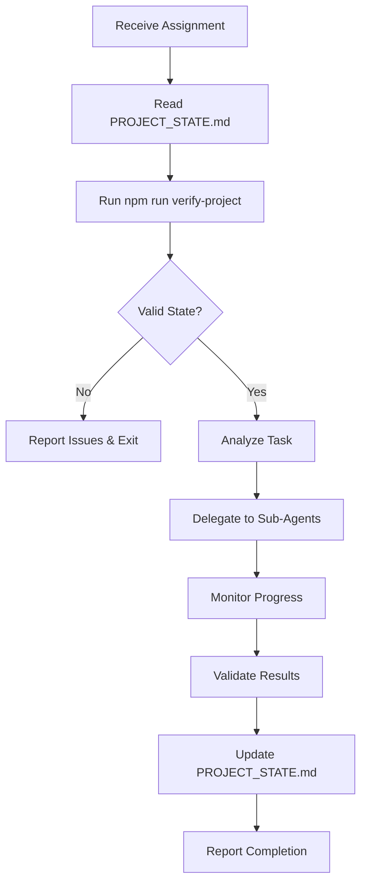

# Multi-Agent Coordination System

This directory contains documentation for the Boris Cherny Multi-Agent Coordination methodology used to build OpsTower.

## Overview

The Multi-Agent Coordination System is a structured 3-tier architecture that enables coordinated development across multiple specialized AI agents. This approach ensures consistency, quality, and systematic progress on complex software projects.

## Architecture

```
Project Coordinator (Tier 1)
    ├── Product & Design Coordinator (Tier 2)
    │   └── Design Agent (Tier 3)
    ├── Development Coordinator (Tier 2)
    │   ├── Frontend Agent (Tier 3)
    │   └── Backend Agent (Tier 3)
    ├── QA Coordinator (Tier 2)
    │   ├── QA Agent (Tier 3)
    │   └── Test Agent (Tier 3)
    ├── Security Coordinator (Tier 2)
    │   ├── Security Agent (Tier 3)
    │   └── Audit Agent (Tier 3)
    ├── Docs & Git Coordinator (Tier 2)
    │   ├── Docs Agent (Tier 3)
    │   └── Git Agent (Tier 3)
    └── Review Coordinator (Tier 2)
        ├── Code Review Agent (Tier 3)
        └── Architecture Agent (Tier 3)
```

## Documentation Files

### Core System
- **[QUICKSTART.md](./QUICKSTART.md)** - Getting started with the coordination system
- **[PROJECT_STATE.md](./PROJECT_STATE.md)** - Central state tracking (created during coordination)
- **[DOMAIN_COORDINATORS.md](./DOMAIN_COORDINATORS.md)** - Overview of all domain coordinators

### Domain Coordinators
- **[PRODUCT_DESIGN_COORDINATOR.md](./PRODUCT_DESIGN_COORDINATOR.md)** - Product requirements and design specifications
- **[DEVELOPMENT_COORDINATOR.md](./DEVELOPMENT_COORDINATOR.md)** - Frontend and backend development workflows
- **[QA_COORDINATOR.md](./QA_COORDINATOR.md)** - Testing strategy and quality assurance
- **[SECURITY_COORDINATOR.md](./SECURITY_COORDINATOR.md)** - Security audits and vulnerability assessment
- **[DOCS_GIT_COORDINATOR.md](./DOCS_GIT_COORDINATOR.md)** - Documentation standards and Git workflows
- **[REVIEW_COORDINATOR.md](./REVIEW_COORDINATOR.md)** - Code review standards and architecture validation

## Key Principles

### 1. State-Driven Coordination
All coordinators read and update `PROJECT_STATE.md` to maintain shared context and prevent conflicts.

### 2. Verification First
Every coordinator must run `npm run verify-project` before starting work to ensure the project is in a valid state.

### 3. Structured Communication
Coordinators communicate using standardized markdown formats:
- Task assignments include context, acceptance criteria, and dependencies
- Status updates follow consistent formats
- Handoffs are explicit with clear next steps

### 4. Domain Specialization
Each coordinator has specific responsibilities and expertise:
- **Product & Design**: User requirements, wireframes, design specs
- **Development**: Implementation of features, bug fixes, refactoring
- **QA**: Test planning, test execution, quality gates
- **Security**: Threat modeling, vulnerability scanning, security reviews
- **Docs & Git**: Documentation, commit messages, PR descriptions
- **Review**: Code quality, architecture patterns, best practices

### 5. Hierarchical Delegation
- Project Coordinator delegates to Domain Coordinators
- Domain Coordinators delegate to specialized Sub-Agents
- Each tier has clear responsibilities and scope

## Workflow

### Standard Coordinator Workflow



### Startup Sequence

1. **Project Coordinator** creates initial `PROJECT_STATE.md`
2. **Verification**: Run `npm run verify-project`
3. **Domain Assessment**: Each coordinator reads state and assesses readiness
4. **Task Distribution**: Coordinator assigns work based on priorities
5. **Execution**: Sub-agents perform specialized work
6. **Integration**: Results are validated and merged
7. **State Update**: `PROJECT_STATE.md` reflects current status

## Using This System for OpsTower

### Current Status
- **Phase**: Pre-Launch → Production Ready
- **Open Issues**: 19 issues (#13-#31) covering security, payments, compliance, testing
- **Priority**: P0 (Critical) issues must be completed first

### Execution Plan

1. **Initialize Coordination**
   - Create `PROJECT_STATE.md` with current status
   - Set up verification scripts
   - Assign coordinators to issue categories

2. **Phase 1: Critical Path (P0 Issues)**
   - Security Coordinator: Secrets management (#13), HTTPS (#14), Database encryption (#15)
   - Development Coordinator: GCash integration (#16)
   - Timeline: 2-3 weeks

3. **Phase 2: High Priority (P1 Issues)**
   - Security Coordinator: MFA (#17), BSP compliance (#21), Audit trail (#24)
   - Development Coordinator: PayMaya (#18), LTFRB compliance (#19)
   - QA Coordinator: E2E tests (#25), Monitoring (#20)
   - Docs & Git Coordinator: Backup verification (#22)
   - Timeline: 4-5 weeks

4. **Phase 3: Launch Readiness (P2 Issues)**
   - Development Coordinator: BIR tax (#26), UX fixes (#28), Mock data (#29)
   - Docs & Git Coordinator: API documentation (#27)
   - Security Coordinator: Session timeouts (#30)
   - Timeline: 3-4 weeks

5. **Phase 4: Polish (P3 Issues)**
   - Development Coordinator: WebSocket edge cases (#31)
   - QA Coordinator: Performance regression tests (#32)
   - Timeline: 1-2 weeks

### Getting Started

1. Read **[QUICKSTART.md](./QUICKSTART.md)** for detailed setup instructions
2. Review the specific coordinator documentation for your role
3. Follow the startup sequence and always verify project state first
4. Use structured communication formats for all handoffs
5. Update `PROJECT_STATE.md` after completing any significant work

## Best Practices

1. **Always Verify First**: Run verification before starting any work
2. **Read State Before Writing**: Check `PROJECT_STATE.md` for current context
3. **Communicate Explicitly**: Use structured formats, no assumptions
4. **Validate Results**: Test your work before marking complete
5. **Update State Promptly**: Keep `PROJECT_STATE.md` current
6. **Report Blockers**: Immediately communicate any issues preventing progress
7. **Request Clarification**: Ask questions rather than guessing requirements

## Resources

- Original methodology by Boris Cherny (adapted for OpsTower)
- GitHub Repository: [nathant30/Current_OpsTowerV1_2026](https://github.com/nathant30/Current_OpsTowerV1_2026)
- Issues: https://github.com/nathant30/Current_OpsTowerV1_2026/issues

## Contact

For questions about this coordination system or OpsTower development, refer to the specific coordinator documentation or consult `PROJECT_STATE.md` for current assigned coordinators.
